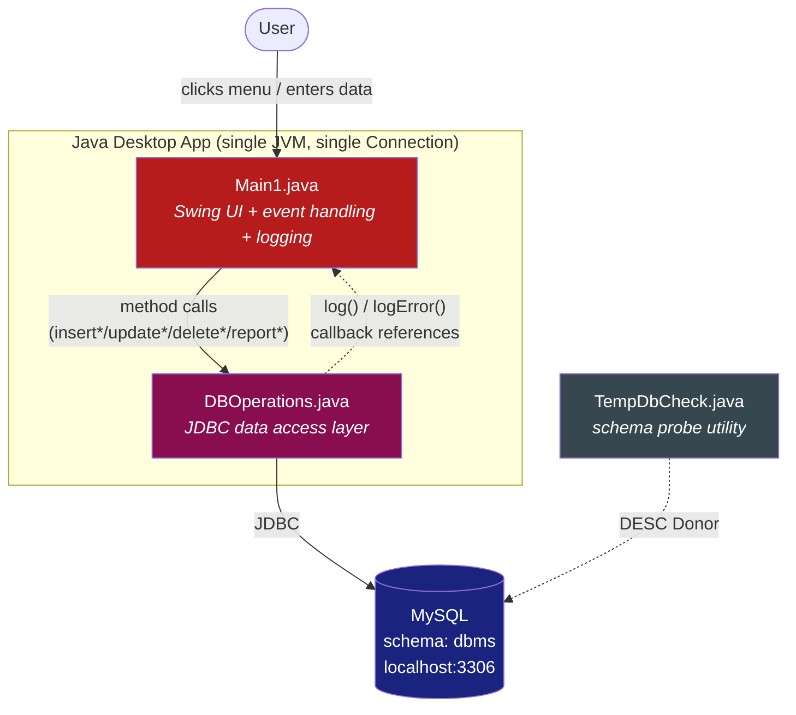
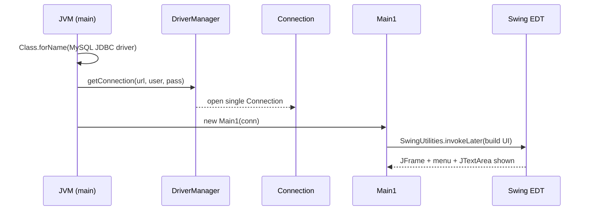
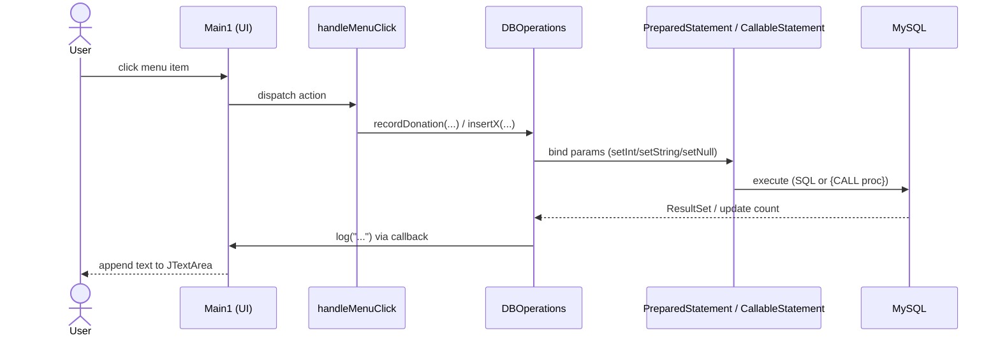
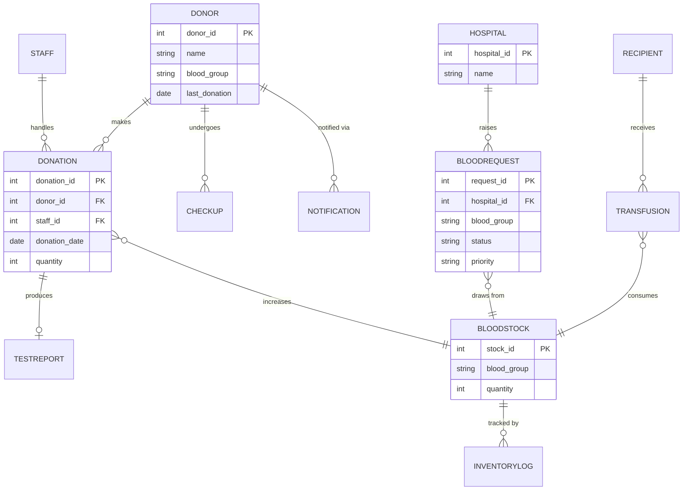
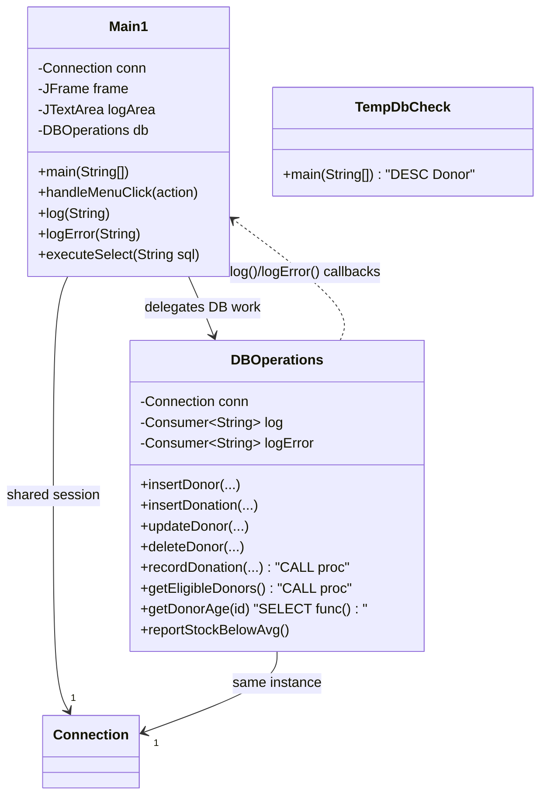
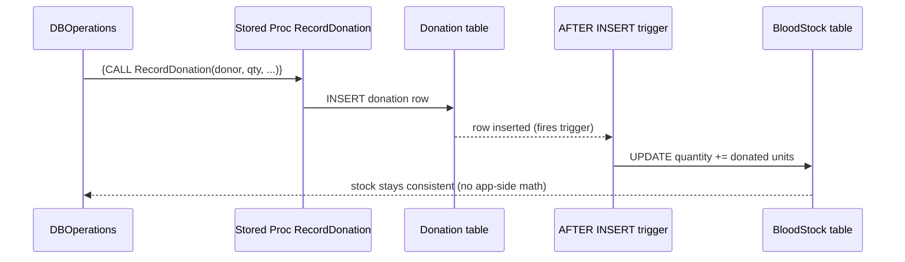

# Blood Bank Management System — Project Overview & Interview Handoff

> **Purpose of this doc.** Two audiences: (1) the candidate, to revise the project fast before the interview; (2) a third party who will **grill** the candidate — the appendix at the end is a ready-to-run question bank with model answers and probe points.

---

## 1. One-line summary & tech stack

A **Java desktop application** for managing a blood bank — donors, donations, checkups, blood stock, hospital requests, and notifications. It performs CRUD operations and generates reports, backed by a MySQL database.

| Layer | Technology |
|---|---|
| UI | Java **Swing** (`JFrame`, `JPanel`, `JPopupMenu`, `JTextArea`, `JOptionPane`) |
| Data access | **JDBC** (`PreparedStatement`, `CallableStatement`, `Statement`) |
| Database | **MySQL**, schema `dbms`, `localhost:3306` |
| Connection | A **single shared `Connection`** opened at startup for the whole session |

---

## 2. What the project does

A Swing-based blood bank management tool that performs **CRUD + reporting** across the domain:

- **Inserts:** donor, checkup, donation, test report, blood request, transfusion, inventory log, recipient, notification
- **Updates:** donor, blood stock quantity, request status
- **Deletes:** donor
- **Reports:** eligible donors, donations with staff, donor + checkup joins, pending hospital requests, blood groups below average stock, and more

It mixes **direct SQL** with **stored procedures and functions**, and relies on **database triggers** for some side effects (e.g. stock updates on donation).

---

## 3. Architecture & layering

Three source files, cleanly split by responsibility:

- **`Main1.java`** — the UI and controller. Builds the Swing frame, a left-side menu of dropdowns, and a central `JTextArea` log panel. Each menu item routes through `handleMenuClick`, which calls the matching data-access method. Owns `log(...)` and `logError(...)`.
- **`DBOperations.java`** — the data-access layer. Holds the `Connection` and **logger callbacks** (`this::log`, `this::logError` passed in from `Main1`). Every insert/update/delete/report/procedure/function call lives here.
- **`TempDbCheck.java`** — a throwaway utility that connects and runs `DESC Donor` to print schema metadata to the console.

The key design seam: `DBOperations` never touches Swing. It writes results back through the **callback functions** it was handed, so the data layer stays independent of how output is rendered.

---

## 4. Runtime flow

### 4a. Application startup

### 4b. A representative user action (e.g. "Insert Donation")

---

## 5. Domain model

The tables the app operates on and their relationships. (Column lists are representative — the interview focus is on *relationships and cardinality*, not exact DDL.)

---

## 6. Class view

---

## 7. Stored procedures, functions & triggers

The project deliberately pushes some business logic **into the database**.

**Stored procedures (via `CallableStatement`, `{CALL ...}`):**
- `RecordDonation` — insert a donation
- `UpdateBloodStockQuantity` — adjust stock
- `UpdateRequestStatus` — change a hospital request's status
- `GetEligibleDonors` — donors eligible to donate
- `GetBloodStockByGroup` — stock for a blood group
- `HospitalRequestSummary` — summarised request report

**Functions (called inside `SELECT`):**
- `CalculateAverageDonationGap` — avg days between donations
- `GetTotalDonationsByDonor` — count per donor
- `GetDonorAge` — age from date of birth

**Triggers (DB-side):** automatically update blood stock and donation-related fields when rows change — so the app doesn't have to do it in Java.

> **Talking point:** "I moved eligibility checks and stock updates into procedures/triggers because they're closer to the data, run atomically in the DB, and are reused regardless of which client calls them."

---

## 8. JDBC features used

- **`PreparedStatement`** — parameterised inserts/updates (values bound, not concatenated → SQL-injection safe).
- **`CallableStatement`** — stored procedures and functions via `{CALL ...}`.
- **`Statement`** — simple/dynamic selects in `executeSelect`.
- **`ResultSetMetaData`** — iterate columns generically to print any result row.
- **`setNull(...)`** — bind nullable parameters correctly.
- **`Date.valueOf(...)` / `Timestamp.valueOf(...)`** — convert strings to SQL temporal types.
- **try-with-resources** — auto-close `PreparedStatement` / `CallableStatement` / `ResultSet`.

---

## 9. SQL concepts demonstrated

- **Joins:** `JOIN`, `LEFT JOIN` (donations with staff, donors with checkups, requests with hospitals).
- **Aggregation:** `GROUP BY`, `HAVING`, `COUNT`.
- **Subqueries:** `WHERE Quantity < (SELECT AVG(Quantity) FROM BloodStock)` — blood groups below average stock.
- **Reporting:** pending high-priority hospital requests, eligible donors.

---

## 10. Strengths (lead with these)

- Clear domain mapping across the whole blood-bank workflow.
- **Parameterised statements** guard against SQL injection.
- Demonstrates **procedures, functions, and triggers** — not just plain queries.
- **Callback-based logging** keeps the DB layer decoupled from Swing.
- Correct Swing threading via `SwingUtilities.invokeLater`.

## 11. Weaknesses & improvements (be ready — interviewers love these)

| Weakness | Improvement |
|---|---|
| `Main1` mixes UI + business logic (God class) | Adopt **MVC**; extract controllers/services |
| Hardcoded DB credentials in source | Externalise to config / env / secrets |
| No transactions or rollback | Set `autoCommit(false)`, `commit`/`rollback` around multi-step writes |
| Single shared `Connection` for the session | Use a **connection pool** (HikariCP) |
| Results shown as appended text | Render in a **`JTable`** with a table model |
| String-concatenated output, no DTOs | Use **model/DTO classes** |
| No package / build tool | Add packages + **Maven/Gradle** |
| Trusting/loosely-validated inputs | Robust parsing + validation before DB calls |

---

# Appendix — Grill Prep (for the interviewer)

**How to use:** ask the question, let the candidate answer, then hit them with the **Probe** follow-up. The **Weak spot** note tells you where candidates usually get shaky — press there.

### A. Fundamentals
1. **Q:** What does this project do, in two sentences?
   - **Model answer:** A Swing desktop app that manages a blood bank (donors, donations, stock, hospital requests, notifications) using JDBC against MySQL, mixing direct SQL with stored procedures/functions.
   - **Probe:** Why a desktop app and not a web app? **Weak spot:** vague "it was the requirement" answers — push for Swing/JDBC trade-offs.

2. **Q:** Walk me through what happens from `main()` to the window appearing.
   - **Model answer:** Load JDBC driver → `DriverManager.getConnection` → `new Main1(conn)` → `invokeLater` builds the frame/menu/log area.
   - **Probe:** Why is the UI built inside `invokeLater`? (see section D)

### B. JDBC
3. **Q:** Difference between `Statement`, `PreparedStatement`, and `CallableStatement`?
   - **Model answer:** `Statement` = static SQL (used in `executeSelect`); `PreparedStatement` = precompiled + bound params (safe, reused); `CallableStatement` = invoke stored procedures/functions via `{CALL ...}`.
   - **Probe:** When would `PreparedStatement` still be unsafe? **Weak spot:** they often think prepared = always safe; press on dynamic table/column names and the `Statement` used in `executeSelect`.

4. **Q:** How do you avoid SQL injection here, and where is a hole?
   - **Model answer:** Parameter binding via `setString/setInt`. Hole: `executeSelect(String sql)` runs arbitrary/concatenated SQL through a plain `Statement`.
   - **Probe:** How would you fix `executeSelect`? **Weak spot:** candidates claim the whole app is injection-proof.

5. **Q:** Explain the JDBC connection lifecycle and resource management.
   - **Model answer:** open Connection → create statement → execute → read ResultSet → close (here via try-with-resources). Connection is opened once and shared.
   - **Probe:** What's the risk of one shared connection for a session? (single-threaded bottleneck, no isolation, one failure kills all). **Weak spot:** they forget the connection is *not* closed per operation.

### C. Database design
6. **Q:** Why put logic in stored procedures/triggers instead of Java?
   - **Model answer:** closer to data, atomic in the DB, reusable across clients, less round-tripping; e.g. `RecordDonation` + trigger updates stock automatically.
   - **Probe:** Downside? (logic split across app + DB, harder to version/test). **Weak spot:** can't name a downside.

7. **Q:** Show me a query using a subquery and why.
   - **Model answer:** blood groups below average stock: `WHERE Quantity < (SELECT AVG(Quantity) FROM BloodStock)`.
   - **Probe:** Correlated vs non-correlated subquery — which is this? **Weak spot:** the distinction.

8. **Q:** What do the functions `GetDonorAge` / `CalculateAverageDonationGap` do and how are they called?
   - **Model answer:** scalar functions invoked inside `SELECT` (not `{CALL}`); compute age / avg gap between donations.
   - **Probe:** Difference between a stored *function* and a *procedure*? **Weak spot:** returns-a-value vs out-params / callable in SQL.

### D. Concurrency & UI
9. **Q:** Why `SwingUtilities.invokeLater`?
   - **Model answer:** Swing is not thread-safe; all UI updates must run on the Event Dispatch Thread (EDT). `invokeLater` queues work onto the EDT.
   - **Probe:** If a DB call is slow, what happens to the UI, and how would you fix it? (EDT freezes → use `SwingWorker`/background thread). **Weak spot:** they don't realise DB calls on the EDT block the UI.

10. **Q (trap):** Two donations are inserted "at the same time" over the single shared `Connection` — what happens?
    - **Model answer:** A JDBC `Connection` is not safe for concurrent use; with one shared connection the calls are effectively serialised/at risk of corruption — no true concurrency. A pool + per-operation connections + transactions is the fix.
    - **Weak spot:** candidates assume it "just works concurrently."

### E. Architecture & quality
11. **Q:** What's wrong with `Main1` being so large?
    - **Model answer:** it mixes UI, event handling, and orchestration — a God class; hard to test and maintain. Fix with MVC / service layer.
    - **Probe:** How is `DBOperations` already a good seam? (callbacks decouple it from Swing → mockable).

12. **Q:** How would you make this testable?
    - **Model answer:** the logger callbacks and the `DBOperations` boundary let you mock the DB layer and assert on logged output; extract interfaces; inject a test `Connection`/H2.
    - **Weak spot:** no concrete strategy.

13. **Q:** Credentials are hardcoded — walk me through fixing that.
    - **Model answer:** move to env vars / a properties file / a secrets manager; never commit secrets.

14. **Q:** There are no transactions. Where does that bite?
    - **Model answer:** any multi-step write (e.g. donation insert + stock update) can half-complete. Wrap in `autoCommit(false)` + `commit`/`rollback`.
    - **Weak spot:** they think triggers make transactions unnecessary.

### F. Extend / "what if" curveballs
15. **Q:** Turn this into a REST web service — what changes?
    - **Model answer:** keep `DBOperations` as a service layer, replace Swing with a REST controller (Spring Boot), add a connection pool, DTOs/JSON, and proper transaction management.
16. **Q:** How would you display results in a real UI instead of a text log?
    - **Model answer:** a `JTable` backed by a `TableModel` populated from the `ResultSet`/DTOs.
17. **Q:** Add connection pooling — why and how?
    - **Model answer:** HikariCP; gives concurrency, reuse, timeouts, and health checks instead of one fragile shared connection.

---

*Diagrams in this document are Mermaid — they render in GitHub, VS Code (Markdown Preview Mermaid Support), and most Markdown viewers.*
