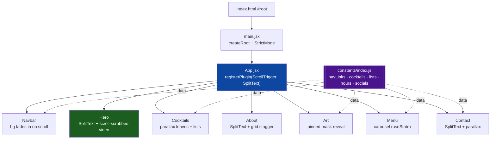
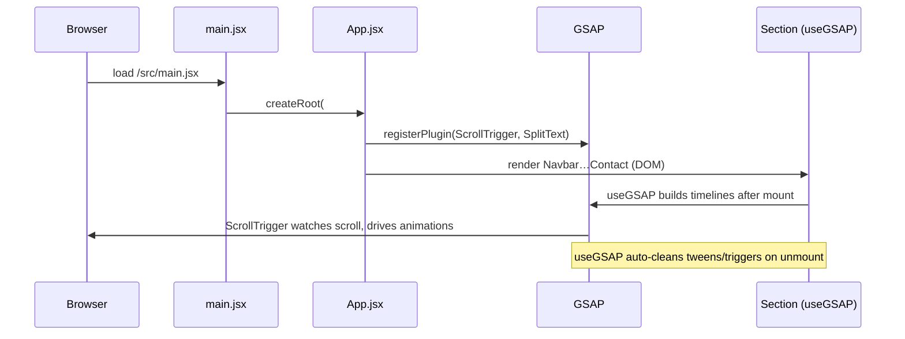
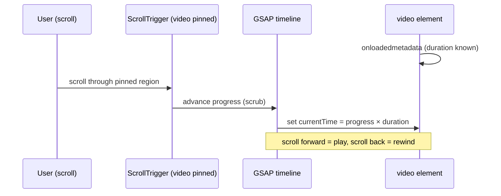
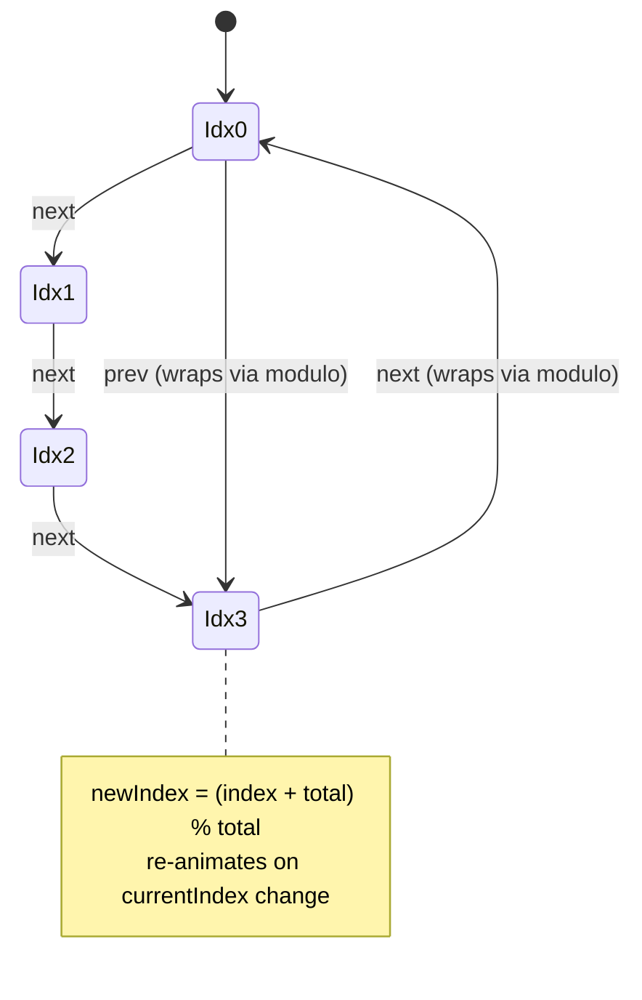

# Drift Academy — Project Overview & Interview Handoff

> **Purpose of this doc.** Two audiences: (1) the candidate, to revise the project fast before the interview; (2) a third party who will **grill** the candidate — the appendix at the end is a ready-to-run question bank with model answers and probe points.
>
> **Honesty note.** This is a **frontend-only, animation-focused landing page** built on a well-known GSAP tutorial template (a cocktail-bar site) and **partially re-themed** as "Drift Academy / DRIFTING" (car hero video + logo). Much of the body content is still cocktail/bar copy. Interview value is in **owning the GSAP animation techniques** — SplitText, scroll-scrubbed video, pinned mask reveals — not in claiming it's an original, fully-branded product. Be upfront that the theming is half-finished; it reads better than being caught.

---

## Table of contents

- [0. 60-second pitch](#0-60-second-pitch)
- [1. One-line summary & tech stack](#1-one-line-summary--tech-stack)
- [2. What the project does](#2-what-the-project-does)
- [3. Architecture & layering](#3-architecture--layering)
- [4. Render & runtime flow](#4-render--runtime-flow)
- [5. The GSAP animation system](#5-the-gsap-animation-system)
- [6. Signature techniques (deep dives)](#6-signature-techniques-deep-dives)
- [7. Section-by-section breakdown](#7-section-by-section-breakdown)
- [8. State, data & responsiveness](#8-state-data--responsiveness)
- [9. Assets & build](#9-assets--build)
- [10. Strengths](#10-strengths)
- [11. Weaknesses & improvements](#11-weaknesses--improvements)
- [Appendix — Grill Prep](#appendix--grill-prep-for-the-interviewer)

---

## 0. 60-second pitch

> *If I say nothing else, I say this:*
>
> "It's a **single-page, scroll-driven animated landing site** built with **React 19 + Vite** and animated entirely with **GSAP**. The standout effects are **GSAP SplitText** — I split headings into characters/words/lines and stagger them in — and a **scroll-scrubbed hero video**, where scrolling literally drives the video's playback position by tying `currentTime` to a pinned ScrollTrigger. Other sections use **pinned CSS-mask reveals**, **parallax** decorative images, and a **content carousel**. Styling is **Tailwind CSS 4**, and it's responsive via `react-responsive`. There's no backend — it's a pure presentational frontend."

The one idea worth leading with: **scroll position is used as an animation timeline**. With ScrollTrigger's `scrub` + `pin`, scrolling doesn't just trigger animations — it *is* the playhead, whether that's scrubbing a video frame-by-frame or driving a mask-reveal.

---

## 1. One-line summary & tech stack

A **frontend-only, single-page** animated marketing site showcasing GSAP scroll storytelling.

| Concern | Technology |
|---|---|
| Framework | **React 19** (function components + hooks, `StrictMode`) |
| Build tool / dev server | **Vite 7** (`@vitejs/plugin-react`, HMR) |
| Styling | **Tailwind CSS 4** via `@tailwindcss/vite` + a custom `index.css` |
| Animation | **GSAP 3.13** + **@gsap/react** (`useGSAP`) |
| GSAP plugins | **ScrollTrigger** (scroll-linked animation) + **SplitText** (text splitting) |
| Responsiveness | **react-responsive** (`useMediaQuery`) |
| Local state | React **`useState`** (only in the Menu carousel) |
| Lint | **ESLint 9** (react-hooks, react-refresh) |
| Language | **JavaScript / JSX** (no TypeScript, though `@types/react` is present) |

> **No 3D, no state library, no router, no backend, no data fetching.** Content is static, imported from `constants/index.js`.

---

## 2. What the project does

A one-page scrolling experience where each section animates into view as you scroll:

- **Hero** — animated headline (SplitText), parallax leaves, and a **background video scrubbed by scroll**.
- **Cocktails** — parallax leaf images on scroll; two static lists (popular cocktails / loved mocktails).
- **About** — SplitText title + a staggered image grid reveal.
- **Art** — a **pinned CSS-mask reveal**: surrounding content fades out while a masked image scales up to unveil hidden text.
- **Menu** — an interactive **carousel** of cocktails with prev/next + tab navigation, re-animating on each change.
- **Contact** — SplitText title, staggered details, parallax leaves; store hours & socials.

Nothing is submitted or fetched — buttons and links are presentational; it's a motion-design showcase.

---

## 3. Architecture & layering

A flat React tree. `App.jsx` registers the GSAP plugins **once**, then renders seven section components top to bottom. All content data lives in `constants/index.js`; each section pulls what it needs.



**Directory shape:**

```
├── index.html            # entry (note: default "Vite + React" title)
├── constants/index.js    # all content data (NOT under src/)
└── src/
    ├── main.jsx           # createRoot → <App/>
    ├── App.jsx            # plugin registration + section composition
    ├── index.css          # Tailwind + custom styles
    └── components/
        ├── Navbar.jsx  Hero.jsx  Cocktails.jsx
        ├── About.jsx   Art.jsx   Menu.jsx  Contact.jsx
```

---

## 4. Render & runtime flow



Every animated section follows the same recipe: mount the DOM, then inside **`useGSAP(() => { … })`** create GSAP timelines bound to `ScrollTrigger`. `useGSAP` scopes the animations and **cleans them up automatically**, avoiding duplicate triggers on re-render.

---

## 5. The GSAP animation system

`App.jsx` registers both plugins globally:

```js
gsap.registerPlugin(ScrollTrigger, SplitText);
```

**ScrollTrigger** links animation to scroll. The knobs used throughout:

| Property | Meaning | Used in |
|---|---|---|
| `trigger` | element whose scroll position drives the timeline | all sections |
| `start` / `end` | scroll window where it runs (e.g. `top top` → `bottom top`) | Hero, Art, Cocktails |
| `scrub` | binds progress to scroll (scroll = playhead) | Hero, Cocktails, Art |
| `pin` | freezes the section on screen while it animates | Hero (video), Art |

**SplitText** breaks a heading into `chars` / `words` / `lines` so each fragment can be staggered independently (used in Hero, About, Contact).

**`useGSAP` dependency arrays** decide when timelines rebuild:
- `[]` → run once on mount (About, Art, Cocktails, Navbar, Contact).
- `[currentIndex]` → **re-run on every carousel change** (Menu).
- `[]` with `isMobile` read inside → chooses mobile vs desktop start/end values (Hero).

---

## 6. Signature techniques (deep dives)

### 6a. Scroll-scrubbed hero video *(the headline trick)*

In `Hero.jsx`, the `<video>` is **pinned**, and a scrubbed timeline animates the video's `currentTime` from 0 to its full `duration` — so scrolling *plays* the video frame-by-frame.



Why `onloadedmetadata`: the tween target `video.duration` is `NaN` until metadata loads, so the timeline is wired up only once the duration is known.

### 6b. Pinned CSS-mask reveal (Art)

A single pinned, scrubbed timeline: fade out the `.will-fade` elements → scale the `.masked-img` up while growing its CSS `maskSize`/`maskPosition` (unveiling the image) → fade in the previously-hidden `#masked-content`.

### 6c. Menu carousel (modular wraparound)

`Menu.jsx` holds `currentIndex` in `useState`. Helpers compute neighbors with modular arithmetic so it **wraps around** cleanly, and `useGSAP([currentIndex])` re-animates the slide on each change:



### 6d. Parallax & navbar
- **Parallax leaves** — decorative images translate on scroll (`scrub`) in Hero, Cocktails, and Contact for depth.
- **Navbar** — a ScrollTrigger fades the nav background from transparent to translucent black once you scroll past it.

---

## 7. Section-by-section breakdown

| Section | Renders | GSAP work |
|---|---|---|
| **Navbar** | Logo + "Drift Academy" + nav links (from `constants`) | Background transparent → `#00000050` on scroll past nav |
| **Hero** | "DRIFTING" title, leaves, body copy, `car.mp4` | SplitText chars/lines stagger; leaf parallax; **scroll-scrubbed pinned video** |
| **Cocktails** | Popular cocktails + loved mocktails lists | Parallax leaf entrance on scroll |
| **About** | Badge, SplitText heading, 5-image grid | Word stagger + grid `stagger` reveal on scroll |
| **Art** | Feature/good lists, masked image, hidden content | **Pinned mask reveal** timeline |
| **Menu** | Cocktail carousel (tabs + prev/next + recipe) | Slide/title/detail re-animate on `currentIndex` |
| **Contact** | Store address, hours, socials, leaves | SplitText title, staggered details, leaf parallax |

All lists/records come from **`constants/index.js`** (`navLinks`, `cocktailLists`, `mockTailLists`, `allCocktails`, `featureLists`, `goodLists`, `openingHours`, `socials`).

---

## 8. State, data & responsiveness

- **State:** the app is almost entirely stateless — the only React state is `currentIndex` in the Menu carousel. Everything else is scroll-driven animation over static content.
- **Data:** static objects/arrays exported from `constants/index.js`; components `.map()` over them.
- **Responsive:** `react-responsive`'s `useMediaQuery({ maxWidth: 767 })` switches ScrollTrigger `start`/`end` values between mobile and desktop (e.g. Hero and Art use different trigger points), so the pinned/scrubbed effects behave sensibly on small screens.

---

## 9. Assets & build

- **`public/videos/`** — `car.mp4` (hero), plus `input.mp4` / `output.mp4`.
- **`public/images/`** — leaves, drinks, profile/about images, social icons, arrows, logo, masks.
- **`public/fonts/`** — a custom display font (`Modern Negra Demo.ttf`).
- **Build:** `npm run dev` (Vite + HMR), `npm run build` → static `dist/`, `npm run preview`, `npm run lint`.
- **Deployment:** no deploy config committed; the static `dist/` drops onto any static host (Netlify/Vercel/GitHub Pages).

---

## 10. Strengths (lead with these)

- **Advanced GSAP fluency** — SplitText, scrubbed video, pinned mask reveals, parallax, and staggering, all coordinated with scroll.
- **`useGSAP` for lifecycle safety** — scoped animations with automatic cleanup; no leaked ScrollTriggers.
- **Clean composition** — small, single-purpose section components; content fully data-driven from `constants/`.
- **Responsive motion** — media queries adjust trigger points instead of running desktop-heavy effects on mobile.
- **Modern stack** — React 19 + Vite 7 + Tailwind 4, fast dev/build.
- **Some accessibility care** — `sr-only` heading and `aria-label`s in the Menu, `rel="noopener noreferrer"` on socials.

## 11. Weaknesses & improvements (be ready — interviewers love these)

| Weakness | Improvement |
|---|---|
| **Half-finished theming** — "Drift Academy/DRIFTING" + car video, but body is cocktails/bar (`jsmcocktail.com`, "Visit Our Bar") | Commit to one theme end-to-end; rewrite copy + data in `constants` |
| **Anchor mismatch** — nav link id `work` (`#work`) but the Art section id is `#art` | Align the id so "The Art" nav link actually scrolls there |
| `Navbar` uses **`backgroundFilter`** (not a real CSS property) instead of `backdropFilter` | Fix to `backdropFilter: 'blur(10px)'` so the blur applies |
| **Default `index.html` title** ("Vite + React") and default template `README` | Set a real `<title>`/favicon and write a project README |
| **SplitText not reverted** after use | Call `split.revert()` in cleanup; splitting before web fonts load can mis-measure |
| **No TypeScript**, no tests, no deploy config | Add TS for prop safety, component tests, and CI/host config |
| Heavy autoplay/scrubbed **video + many images** | Compress assets, lazy-load, respect `prefers-reduced-motion` |

---

# Appendix — Grill Prep (for the interviewer)

**How to use:** ask the question, let the candidate answer, then hit them with the **Probe** follow-up. The **Weak spot** note tells you where candidates usually get shaky — press there.

### A. Fundamentals
1. **Q:** What is this project and what's the interesting technical part?
   - **Model answer:** A single-page, scroll-animated React + Vite landing site; the interesting part is GSAP-driven motion — SplitText text reveals, a scroll-scrubbed hero video, and pinned CSS-mask reveals.
   - **Probe:** Is there any backend or data fetching? **Weak spot:** it's purely presentational — no server, no state library.

2. **Q:** Trace what happens from page load to the first animation firing.
   - **Model answer:** `index.html` → `main.jsx` `createRoot(<App/>)` → App registers ScrollTrigger + SplitText → sections render → each section's `useGSAP` builds ScrollTrigger timelines after mount.

### B. GSAP core
3. **Q:** What do ScrollTrigger `scrub` and `pin` do?
   - **Model answer:** `scrub` ties timeline progress to scroll position (scrolling scrubs the animation); `pin` fixes the element in the viewport while its timeline plays.
   - **Probe:** What does pinning do to page layout? **Weak spot:** not knowing it inserts spacing so following content doesn't jump.

4. **Q:** Why use `useGSAP` instead of `useEffect` + `gsap`?
   - **Model answer:** `useGSAP` scopes selectors and **auto-reverts** tweens/ScrollTriggers on unmount or dependency change, preventing leaks and duplicate triggers.
   - **Probe:** What breaks if you forget cleanup? **Weak spot:** stacked/duplicate ScrollTriggers after HMR or re-render.

5. **Q:** How do the `useGSAP` dependency arrays differ across components, and why?
   - **Model answer:** Most use `[]` (run once). The Menu uses `[currentIndex]` so the slide animation re-runs each time the carousel changes.

### C. SplitText
6. **Q:** What is SplitText and how is it used here?
   - **Model answer:** A GSAP plugin that splits text into chars/words/lines wrapped in spans, so you can stagger-animate each piece; used for the Hero, About, and Contact headings.
   - **Probe:** What's a common bug with SplitText + custom fonts? **Weak spot:** splitting before the font loads gives wrong line breaks; and not calling `revert()` leaves markup behind.

### D. The video scrub
7. **Q:** Explain how scrolling controls the hero video.
   - **Model answer:** The video is pinned; a scrubbed ScrollTrigger timeline tweens `video.currentTime` from 0 to `video.duration`, so scroll progress maps to playback position.
   - **Probe:** Why set this up inside `onloadedmetadata`? **Weak spot:** `duration` is `NaN` until metadata loads, so the tween needs to wait.
   - **Probe 2:** Any mobile pitfalls? (autoplay/scrubbing policies, decode cost, needs `muted` + `playsInline`).

### E. State, structure & responsiveness
8. **Q:** How does the Menu carousel work without going out of bounds?
   - **Model answer:** `currentIndex` in `useState`; neighbors computed as `(index + total) % total`, so prev/next wrap around; changing the index re-triggers the entrance animation.
   - **Probe:** Why modulo instead of clamping? (wraparound vs stopping at the ends).

9. **Q:** How is the site made responsive?
   - **Model answer:** `react-responsive`'s `useMediaQuery` at 767px switches ScrollTrigger `start`/`end` values so pinned/scrubbed effects behave on mobile.
   - **Weak spot:** thinking Tailwind breakpoints alone handle the animation differences.

10. **Q:** Where does all the content live and why is that good?
    - **Model answer:** In `constants/index.js`; components map over it, keeping them declarative and making copy/data easy to change in one place.

### F. Quality & "what if" curveballs
11. **Q (trap):** The site is called "Drift Academy" with a car video, but the menu is cocktails and the footer says "Visit Our Bar." What happened?
    - **Model answer:** It's a **partially re-themed** template — the hero was rebranded but the body content wasn't. I'd finish the theming by rewriting the copy and the data in `constants`.
    - **Weak spot:** pretending it's fully original/intentional.

12. **Q:** The navbar blur doesn't apply — why?
    - **Model answer:** It sets `backgroundFilter`, which isn't a real CSS property; it should be `backdropFilter: 'blur(10px)'`.
    - **Weak spot:** not knowing `backdrop-filter` is the correct property.

13. **Q:** "The Art" nav link doesn't scroll anywhere — why?
    - **Model answer:** Its `id` is `work` so the anchor is `#work`, but the section's id is `#art` — a mismatch. Align them.

14. **Q:** How would you improve performance?
    - **Model answer:** Compress/lazy-load the video and images, respect `prefers-reduced-motion`, and avoid animating layout-triggering properties (prefer transforms/opacity).

15. **Q:** How would you deploy this?
    - **Model answer:** `vite build` → static `dist/` on Netlify/Vercel/GitHub Pages; add a host config + CI. No server required.

16. **Q:** What would TypeScript add here specifically?
    - **Model answer:** Typed `constants` records and component props — it would catch things like the `#work`/`#art` mismatch class of errors and typo'd CSS keys earlier.

---

*Diagrams in this document are Mermaid — they render in GitHub, VS Code (Markdown Preview Mermaid Support), and most Markdown viewers.*
