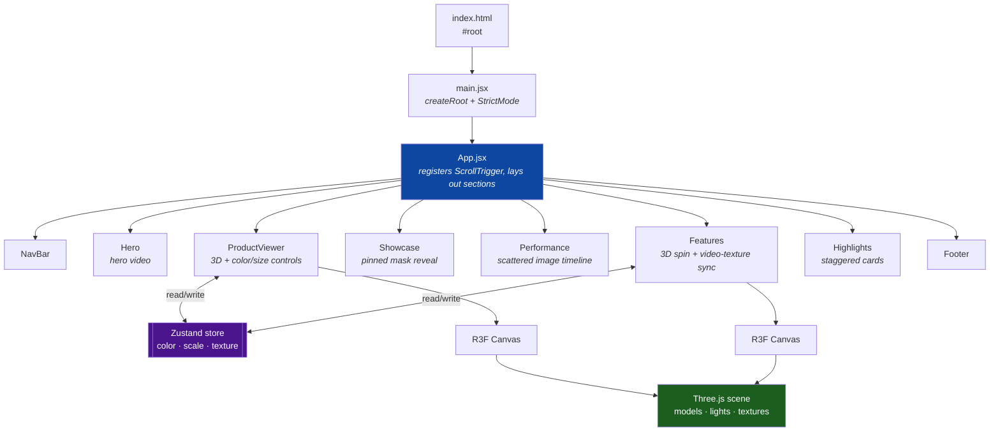
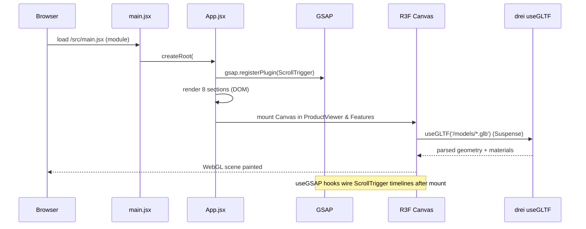
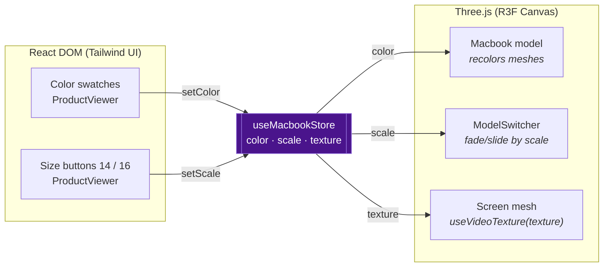
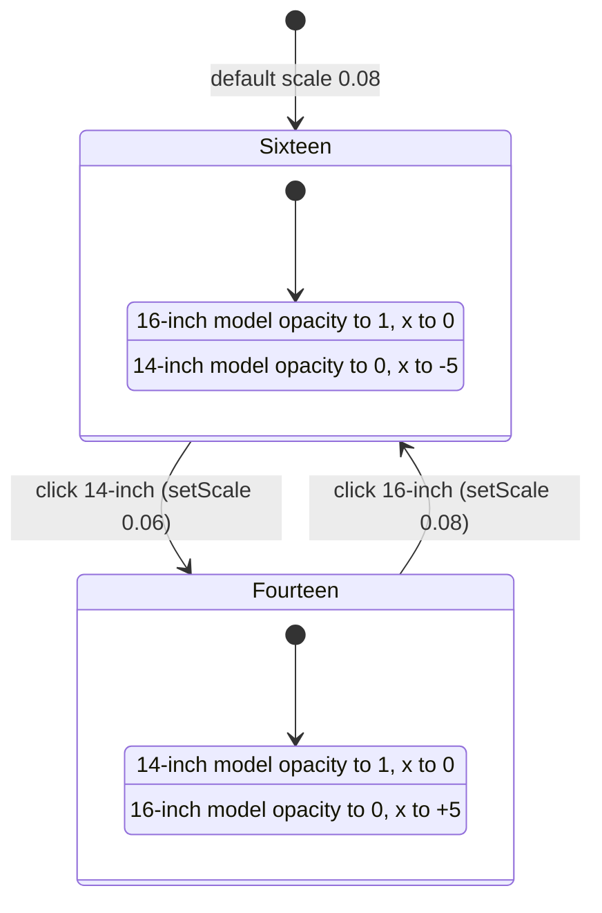

# MacBook Pro Website — Project Overview & Interview Handoff

> **Purpose of this doc.** Two audiences: (1) the candidate, to revise the project fast before the interview; (2) a third party who will **grill** the candidate — the appendix at the end is a ready-to-run question bank with model answers and probe points.
>
> **Honesty note.** This is a **frontend-only** portfolio build (an Apple MacBook Pro marketing-page clone) that follows a well-known 3D/GSAP tutorial pattern. The 3D model components are **auto-generated** (gltfjsx). Interview value comes from *understanding every moving part* — React Three Fiber, scroll-driven animation, and shared 3D state — not from claiming it's original product work.

---

## Table of contents

- [0. 60-second pitch](#0-60-second-pitch)
- [1. One-line summary & tech stack](#1-one-line-summary--tech-stack)
- [2. What the project does](#2-what-the-project-does)
- [3. Architecture & layering](#3-architecture--layering)
- [4. Render & runtime flow](#4-render--runtime-flow)
- [5. State management (Zustand)](#5-state-management-zustand)
- [6. The 3D subsystem (React Three Fiber)](#6-the-3d-subsystem-react-three-fiber)
- [7. Scroll animation system (GSAP ScrollTrigger)](#7-scroll-animation-system-gsap-scrolltrigger)
- [8. Section-by-section breakdown](#8-section-by-section-breakdown)
- [9. Responsive strategy](#9-responsive-strategy)
- [10. Assets, content & build](#10-assets-content--build)
- [11. Strengths](#11-strengths)
- [12. Weaknesses & improvements](#12-weaknesses--improvements)
- [Appendix — Grill Prep](#appendix--grill-prep-for-the-interviewer)

---

## 0. 60-second pitch

> *If I say nothing else, I say this:*
>
> "It's a **single-page, animated Apple-style marketing site** for the MacBook Pro, built with **React 19 + Vite**. The centerpiece is an **interactive 3D MacBook** rendered with **Three.js via React Three Fiber** — you can drag to rotate it, switch between the **14" and 16"** models, and change its **color**, all driven by a small **Zustand** store. As you scroll, **GSAP ScrollTrigger** spins the model 360°, swaps the video playing on its screen to match each feature, and reveals content section by section. Styling is **Tailwind CSS 4**, and it's fully **responsive** via `react-responsive` media queries."

The one idea worth leading with: **a single Zustand store is the shared source of truth between the DOM UI controls and the WebGL scene** — clicking a color/size button in React updates the store, and the 3D model re-reads it and re-renders. That bridge between the React DOM world and the Three.js canvas is the interesting part.

---

## 1. One-line summary & tech stack

A **frontend-only, single-page** Apple MacBook Pro product site: scroll-driven storytelling with an interactive WebGL 3D laptop.

| Concern | Technology |
|---|---|
| Framework | **React 19** (function components + hooks, `StrictMode`) |
| Build tool / dev server | **Vite 7** (`@vitejs/plugin-react`, HMR) |
| Styling | **Tailwind CSS 4** via the `@tailwindcss/vite` plugin + a custom `index.css` |
| 3D rendering | **Three.js 0.180** through **@react-three/fiber 9** (React renderer for Three) |
| 3D helpers | **@react-three/drei 10** (`useGLTF`, `useVideoTexture`, `PresentationControls`, `OrbitControls`, `Environment`, `Lightformer`, `Html`) |
| Animation | **GSAP 3.13** + **@gsap/react** (`useGSAP`) + **ScrollTrigger** plugin |
| Global state | **Zustand 5** (`create`) |
| Responsiveness | **react-responsive** (`useMediaQuery`) |
| Class utility | **clsx** (conditional classNames) |
| Lint | **ESLint 9** (react-hooks, react-refresh plugins) |
| Language | **JavaScript / JSX** (no TypeScript, though `@types/react` is present) |

> **No backend, no database, no auth, no routing** — it's a static SPA. Everything is client-side.

---

## 2. What the project does

A one-page scrolling experience with an interactive 3D MacBook. The user can:

- **Rotate** the 3D MacBook by dragging (`PresentationControls`).
- **Switch size** between 14" and 16" — the two models cross-fade and slide.
- **Change color** (silver / space black) — applied to the model's meshes at runtime.
- **Scroll** to trigger cinematic animations: the model spins 360°, its **screen video changes** per feature, images fly into position, and text blocks fade/slide in.

It's a **presentational marketing site** — no forms submit, no data is fetched; the "Buy", search, and cart buttons are decorative.

---

## 3. Architecture & layering

A flat single-page React tree. `App.jsx` composes eight section components top to bottom; a **Zustand store** sits beside them as shared 3D state; the 3D sections mount a **React Three Fiber `<Canvas>`** that renders the Three.js scene.



**Directory shape:**

```
src/
├── main.jsx              # entry: createRoot → <App/>
├── App.jsx               # section composition + ScrollTrigger register
├── index.css            # Tailwind + all custom styles
├── constants/index.js    # navLinks, features, performance data, footerLinks, noChangeParts
├── store/index.js         # Zustand useMacbookStore (color, scale, texture)
└── components/
    ├── NavBar / Hero / Showcase / Performance / Highlights / Footer   # DOM sections
    ├── ProductViewer.jsx   # 3D viewer + controls
    ├── Features.jsx        # scroll-synced 3D + feature copy
    ├── three/
    │   ├── StudioLights.jsx    # Environment + Lightformers + spotlights
    │   └── ModelSwitcher.jsx   # 14"/16" cross-fade logic
    └── models/
        ├── Macbook.jsx / Macbook-14.jsx / Macbook-16.jsx   # gltfjsx-generated
```

---

## 4. Render & runtime flow



Key point: the **DOM sections and the WebGL canvases render together** in one React tree. Three.js content mounts *inside* React via `<Canvas>`, and `useGLTF` suspends until the `.glb` model is parsed (a `<Suspense>` fallback shows "Loading…").

---

## 5. State management (Zustand)

A single tiny store is the bridge between DOM controls and the 3D scene.

```js
// src/store/index.js
const useMacbookStore = create((set) => ({
  color: '#2e2c2e',                 setColor: (color) => set({ color }),
  scale: 0.8,                        setScale: (scale) => set({ scale }),
  texture: '/videos/feature-1.mp4',  setTexture: (texture) => set({ texture }),
  reset: () => set({ color:'#2e2c2e', scale:0.08, texture:'/videos/feature-1.mp4' }),
}));
```



- **`color`** — read in `Macbook.jsx`, applied by traversing the scene and setting `child.material.color` on every mesh **except** those in `noChangeParts` (screen, keyboard, ports — parts that shouldn't be tinted).
- **`scale`** — read by `ModelSwitcher` to decide whether the 14" or 16" model is shown, and to size it.
- **`texture`** — a **video path**; `Features.jsx` swaps it during scroll so the MacBook's screen plays the video matching the current feature (via drei's `useVideoTexture`).

Why Zustand here: the UI controls live in the **DOM tree** while the model lives in the **WebGL tree** — they're not parent/child, so lifting state up is awkward. A store lets both subscribe independently without prop-drilling across the Canvas boundary.

---

## 6. The 3D subsystem (React Three Fiber)

React Three Fiber (R3F) lets you describe a Three.js scene as JSX. `<mesh>`, `<group>`, `<spotLight>` are React elements that map to Three objects.

**Lighting — `StudioLights.jsx`:** a drei `<Environment>` with two `<Lightformer>` rectangles (soft studio reflections on the metal) plus three `<spotLight>`s for key/fill/rim lighting.

**Models — `models/*.jsx`:** generated by `gltfjsx` from the `.glb` files. `Macbook.jsx`:
- `useGLTF('/models/macbook-transformed.glb')` → `{ nodes, materials, scene }`.
- `useVideoTexture(texture)` → maps the current store video onto the screen mesh (`<meshBasicMaterial map={screen} />`).
- A `useEffect` traverses the scene and recolors meshes to the store `color`, skipping `noChangeParts`.
- `useGLTF.preload(...)` warms the model cache.

**Size switching — `ProductViewer.jsx` + `ModelSwitcher.jsx`:** both a 14" and a 16" model are mounted at once inside `PresentationControls` (drag-to-rotate). `ModelSwitcher` uses `useGSAP` to **cross-fade opacity and slide** one model out and the other in whenever `scale` changes.



> **Talking point:** "I render both models and cross-fade with GSAP rather than unmounting/remounting, so switching size is a smooth animation instead of a pop — and there's no reload cost because both `.glb`s are already in the scene."

---

## 7. Scroll animation system (GSAP ScrollTrigger)

`App.jsx` registers the plugin once (`gsap.registerPlugin(ScrollTrigger)`). Each animated section uses the **`useGSAP`** hook (auto-cleanup on unmount) to build a timeline tied to scroll position.

Common ScrollTrigger config used across sections:
- **`trigger`** — the element whose scroll position drives the timeline.
- **`scrub`** — ties animation progress to scroll (scrolling *is* the playhead).
- **`pin`** — freezes the section on screen while its animation plays.
- **`start` / `end`** — the scroll window over which it runs.

The most sophisticated one is **Features** — a scroll timeline that both **spins the 3D model 360°** and **swaps the screen video + reveals copy** in lockstep:

```mermaid
sequenceDiagram
    participant U as User (scroll)
    participant ST as ScrollTrigger (#f-canvas, pinned)
    participant TL as GSAP timeline
    participant S as Zustand setTexture
    participant M as Model (screen video)
    participant BOX as box1..5 feature copy

    U->>ST: scroll through pinned section
    ST->>TL: advance timeline (scrub)
    TL->>M: rotate group.y → 2π (360° spin)
    TL->>S: setTexture('/videos/feature-1.mp4')
    S->>M: screen shows feature-1 video
    TL->>BOX: reveal .box1 (opacity/​y)
    Note over TL,BOX: repeats for feature-2 … feature-5 as scroll continues
```

Videos for all five features are **preloaded on mount** (`Features.jsx` creates hidden `<video>` elements) so the texture swap is instant.

---

## 8. Section-by-section breakdown

| Section | What it renders | Animation / logic |
|---|---|---|
| **NavBar** | Apple logo, nav links (from `constants`), search/cart buttons | Static |
| **Hero** | Title image + autoplay `hero.mp4` + price | `useEffect` sets `videoRef.playbackRate = 2` |
| **ProductViewer** | R3F `<Canvas>` with 14"/16" models, color + size controls | Zustand-driven; `PresentationControls` drag; `ModelSwitcher` cross-fade |
| **Showcase** | Video + logo-mask + "Rocket Chip" copy | Pinned + scrubbed: mask scales up, content fades in (desktop only) |
| **Performance** | 7 scattered images + copy | Scroll timeline animates each image to its final `left/right/bottom` position; text reveal |
| **Features** | R3F `<Canvas>` MacBook + 5 feature boxes | Scroll spins model 360°, swaps screen video, reveals each box |
| **Highlights** | Masonry grid of 4 upgrade cards | Staggered fade/slide-in on scroll |
| **Footer** | Contact line + footer links (from `constants`) | Static |

All copy and data (nav links, features, performance image positions, footer links) live in **`src/constants/index.js`**, keeping components declarative.

---

## 9. Responsive strategy

- **`react-responsive`'s `useMediaQuery({ query: '(max-width: 1024px)' })`** is the single breakpoint used across `ProductViewer`, `Features`, `Showcase`, `Performance`, and `Highlights`.
- On mobile/tablet the code **reduces model scale** and **disables the heavy pinned/scrubbed animations** (e.g. `Showcase` and `Performance` skip their timelines) — desktop gets the cinematic version, mobile gets a lighter static layout.
- Tailwind responsive prefixes (`md:`, `lg:`) handle DOM layout.

---

## 10. Assets, content & build

- **`public/models/`** — six `.glb` files (14", 16", base MacBook, each plus a `-transformed` optimized variant).
- **`public/videos/`** — `hero.mp4`, `game.mp4`, and `feature-1..5.mp4` (screen textures).
- **`public/`** — feature icons, performance images, product images, SVG logos, and custom **Apple-style `.otf` fonts** (`public/fonts/`).
- **Build:** `npm run dev` (Vite dev server + HMR), `npm run build` → `dist/`, `npm run preview`, `npm run lint`.
- **Deployment:** no deploy config is committed (no `netlify.toml`/`vercel.json`). It's a static `dist/` that can drop onto any static host (Netlify/Vercel/GitHub Pages). *(An `install.sh` script is present at the repo root.)*

---

## 11. Strengths (lead with these)

- **Bridges DOM ↔ WebGL cleanly** via a single Zustand store — the standout architectural idea.
- **Declarative 3D** with React Three Fiber instead of imperative Three.js boilerplate.
- **Scroll-as-timeline** UX with GSAP ScrollTrigger (scrub + pin) — pro-level motion design.
- **Performance-aware:** video textures preloaded; `.glb`s preloaded and served as optimized `-transformed` variants; models cross-faded rather than remounted.
- **Data-driven content** in `constants/` keeps components clean.
- **Responsive degradation** — expensive animations disabled on smaller screens.

## 12. Weaknesses & improvements (be ready — interviewers love these)

| Weakness | Improvement |
|---|---|
| **No TypeScript** (JSX only, though `@types/react` is installed) | Migrate to `.tsx` for prop/store type safety |
| Store **initial `scale: 0.8`** looks wrong (controls use `0.06`/`0.08`; `reset` uses `0.08`) | Fix the initial value to `0.08` for a consistent first paint |
| `Hero.jsx` uses **`playInline`** (invalid) instead of `playsInline`; `useEffect` has **no dependency array** | Correct the attribute; add `[]` deps |
| **Unused imports** (`Box`, `OrbitControls`, `MacbookModel14` in `ProductViewer`) | Remove dead imports; lint would catch it |
| Color/size controls are **clickable `<div>`s**, nav uses `href={label}` | Use real `<button>`/anchors + `aria` for accessibility |
| **Large media** (`.glb`, `.mp4`) shipped in `public/` | Lazy-load, compress (Draco/KTX2), or serve from a CDN |
| **No tests, no error boundaries, no deploy config** | Add a Canvas error boundary, basic component tests, CI + host config |
| Heavy WebGL + autoplay video → **battery/perf cost** | Respect `prefers-reduced-motion`; pause offscreen videos |

---

# Appendix — Grill Prep (for the interviewer)

**How to use:** ask the question, let the candidate answer, then hit them with the **Probe** follow-up. The **Weak spot** note tells you where candidates usually get shaky — press there.

### A. Fundamentals
1. **Q:** What is this project and what's the interesting technical part?
   - **Model answer:** A single-page animated MacBook marketing site in React + Vite; the interesting part is an interactive Three.js 3D model whose color/size/screen-video are driven by a shared Zustand store and animated on scroll with GSAP.
   - **Probe:** Why is there no backend? **Weak spot:** treating it as full-stack — it's a static frontend SPA.

2. **Q:** Trace what happens from page load to the 3D model appearing.
   - **Model answer:** `index.html` → `main.jsx` `createRoot(<App/>)` → App registers ScrollTrigger and renders sections → R3F `<Canvas>` mounts → `useGLTF` suspends while parsing the `.glb` → scene paints.
   - **Probe:** What does the user see while the model loads? (the `<Suspense>` "Loading…" `<Html>` fallback).

### B. React Three Fiber / Three.js
3. **Q:** What is React Three Fiber and why use it over plain Three.js?
   - **Model answer:** It's a React renderer for Three.js — you describe the scene as JSX (`<mesh>`, `<group>`, `<spotLight>`) and R3F reconciles it, giving you React's component model, hooks, and state instead of imperative `scene.add()` code.
   - **Probe:** What actually runs the render loop? **Weak spot:** not knowing `<Canvas>` sets up the renderer, camera, and `requestAnimationFrame` loop for you.

4. **Q:** How does the 3D model get into the app, and what is `useGLTF`?
   - **Model answer:** The `.glb` was run through `gltfjsx` to generate a JSX component; `useGLTF` (drei) loads/caches the glTF and returns `nodes`/`materials` used by `<mesh>`s. `useGLTF.preload` warms the cache.
   - **Probe:** What's the risk of committing auto-generated model files? **Weak spot:** owning that you must still understand them.

5. **Q:** How is the color change applied to the model?
   - **Model answer:** On `color` change, a `useEffect` traverses the scene graph and sets `child.material.color = new Color(color)` on each mesh, skipping `noChangeParts` (screen/keyboard/ports).
   - **Probe:** Why exclude `noChangeParts`, and why traverse instead of setting one material? **Weak spot:** not realizing the model is many meshes/materials.

6. **Q:** How does a video end up playing on the laptop screen?
   - **Model answer:** drei's `useVideoTexture(texture)` turns a video URL into a Three texture mapped onto the screen mesh via `<meshBasicMaterial map={screen} />`; the URL comes from the store and changes on scroll.

### C. State management
7. **Q:** Why Zustand, and why not `useState`/Context?
   - **Model answer:** The controls live in the DOM tree and the model lives inside the `<Canvas>` (WebGL) tree — they're siblings, not parent/child, so lifting state is awkward. Zustand gives both a shared store with no provider boilerplate and no prop-drilling across the Canvas boundary.
   - **Probe:** Would Context cause extra re-renders here? **Weak spot:** Zustand's selector-based subscriptions vs Context re-rendering all consumers.

8. **Q:** Walk me through the data flow when I click the 14" button.
   - **Model answer:** `setScale(0.06)` updates the store → `ModelSwitcher` reads `scale`, sees it's not the "large" value → GSAP fades/slides the 16" model out and the 14" in.

### D. Animation
9. **Q:** Explain ScrollTrigger `scrub` and `pin`.
   - **Model answer:** `scrub` binds timeline progress to scroll position (scrolling scrubs the animation); `pin` fixes the section in the viewport while its timeline plays, so the user "scrolls through" the animation.
   - **Probe:** What happens to layout when you pin? (a spacer is added; other content shifts) **Weak spot:** not knowing pinning affects document flow.

10. **Q:** What does `useGSAP` give you over calling `gsap` in `useEffect`?
    - **Model answer:** Scoped selectors and **automatic cleanup** of tweens/ScrollTriggers on unmount/deps-change, avoiding leaks and duplicate triggers.
    - **Weak spot:** ignoring animation cleanup entirely.

11. **Q:** In Features, how are the model spin and the text/video changes kept in sync?
    - **Model answer:** Both are on scroll timelines tied to the same pinned `#f-canvas` trigger; `.call(() => setTexture(...))` swaps the store video while `.to('.boxN', ...)` reveals the matching copy, and a separate timeline rotates the group to `Math.PI * 2`.

### E. Performance & quality
12. **Q:** This ships big `.glb` and `.mp4` files — what are the performance implications?
    - **Model answer:** Large initial download, WebGL GPU cost, and autoplay videos drain battery. Mitigate with compression (Draco/KTX2), lazy-loading, CDN, pausing offscreen videos, and `prefers-reduced-motion`.
    - **Weak spot:** no perf awareness for 3D/video.

13. **Q (trap):** The store's initial `scale` is `0.8` but every control and the reset use `0.06`/`0.08`. What's going on?
    - **Model answer:** Looks like a **bug/typo** — the initial value should almost certainly be `0.08`; as-is the first render can be inconsistent with the size buttons.
    - **Weak spot:** not spotting it, or insisting it's intentional.

14. **Q:** How is this made responsive?
    - **Model answer:** `react-responsive`'s `useMediaQuery` at a 1024px breakpoint scales the model down and disables the pinned/scrubbed animations on mobile; Tailwind prefixes handle DOM layout.
    - **Probe:** Why disable animations on mobile rather than just scale them? (perf + pin/scroll conflicts on touch).

### F. Extend / "what if" curveballs
15. **Q:** Add TypeScript — what do you gain here specifically?
    - **Model answer:** Typed store actions and model/props, catching things like the `scale` mismatch and the `playInline` typo at compile time.
16. **Q:** Make it a real product page with "Buy" working — what changes?
    - **Model answer:** Add routing, a backend/commerce API, cart state (extend Zustand or add a cart store), forms with validation, and payment integration.
17. **Q:** Add an error boundary around the 3D — why?
    - **Model answer:** WebGL/`glb` load can fail (unsupported GPU, network); an error boundary + Suspense fallback keeps the rest of the page usable instead of crashing the tree.
18. **Q:** How would you deploy this?
    - **Model answer:** `vite build` → static `dist/` on Netlify/Vercel/GitHub Pages; add a host config and CI. No server needed.

---

*Diagrams in this document are Mermaid — they render in GitHub, VS Code (Markdown Preview Mermaid Support), and most Markdown viewers.*
