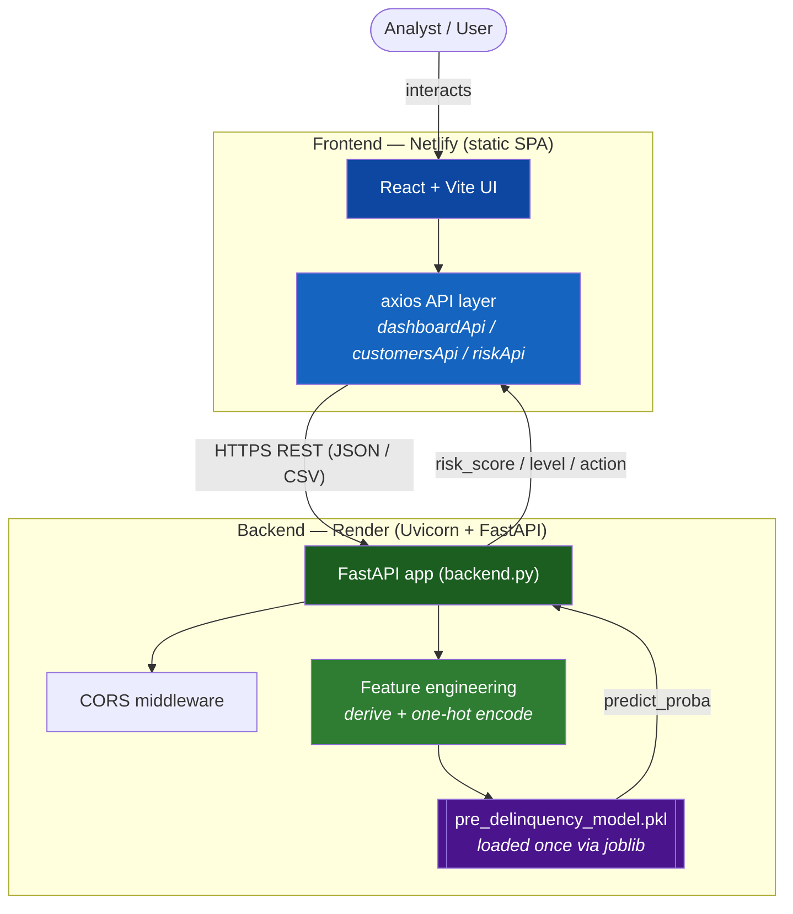
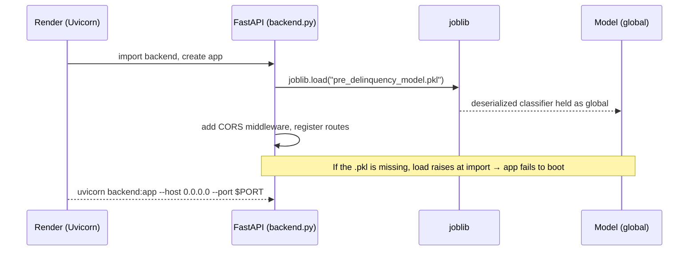
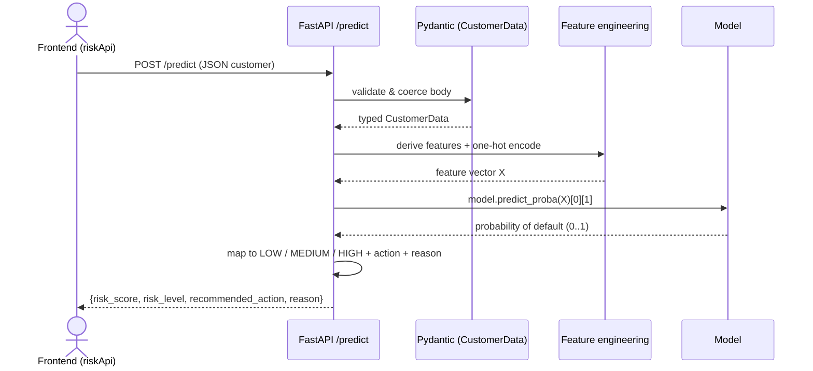
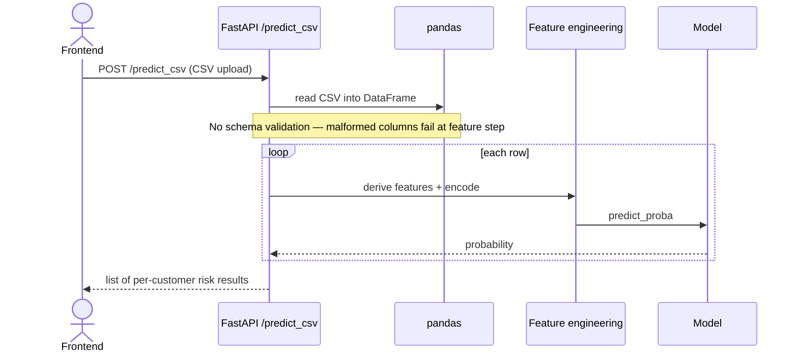
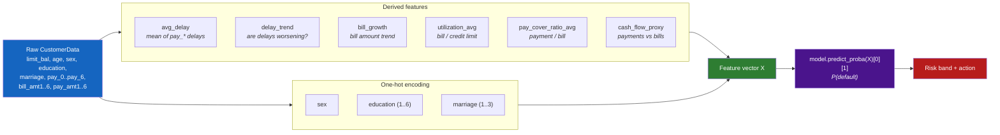
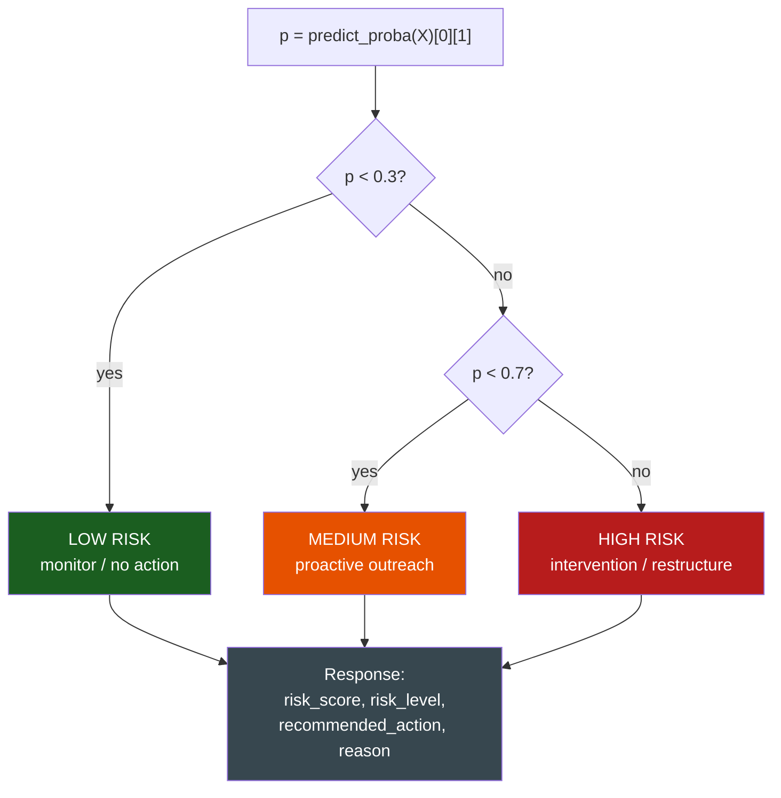
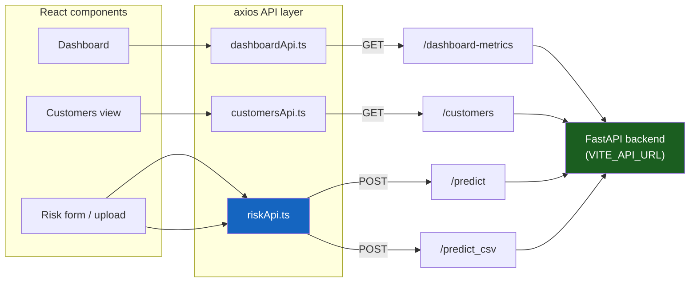
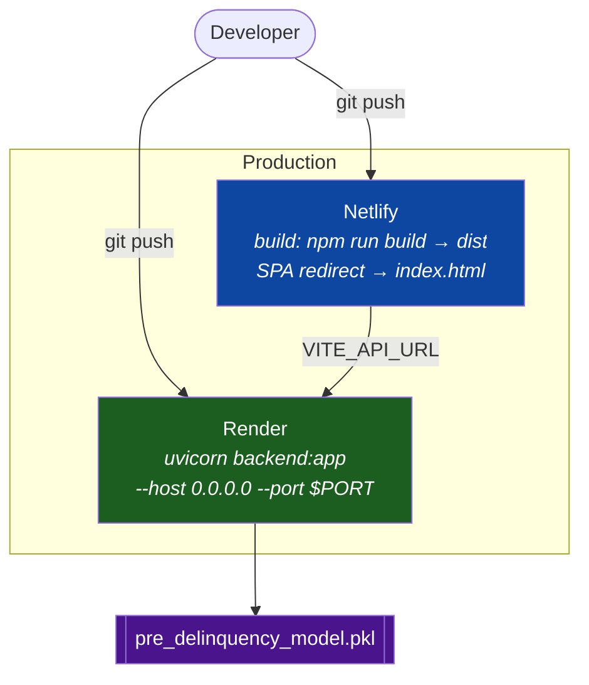

# Pre-Delinquency Intervention Engine — Project Overview & Interview Handoff

> **Purpose of this doc.** Two audiences: (1) the candidate, to revise the project fast before the interview; (2) a third party who will **grill** the candidate — the appendix at the end is a ready-to-run question bank with model answers and probe points.
>
> **Note on scope.** This doc is reconstructed from a code walkthrough. Where an exact internal detail isn't confirmed (e.g. the precise model algorithm inside the `.pkl`), it's flagged as such rather than guessed.

---

## Table of contents

- [0. 60-second pitch](#0-60-second-pitch)
- [1. One-line summary & tech stack](#1-one-line-summary--tech-stack)
- [2. What the project does](#2-what-the-project-does)
- [3. Architecture & layering](#3-architecture--layering)
- [4. Runtime flow](#4-runtime-flow)
- [5. ML pipeline & feature engineering](#5-ml-pipeline--feature-engineering)
- [6. API surface](#6-api-surface)
- [7. Input contract (CustomerData)](#7-input-contract-customerdata)
- [8. Risk scoring logic](#8-risk-scoring-logic)
- [9. Frontend integration](#9-frontend-integration)
- [10. Deployment / hosting](#10-deployment--hosting)
- [11. Strengths](#11-strengths)
- [12. Weaknesses & improvements](#12-weaknesses--improvements)
- [Appendix — Grill Prep](#appendix--grill-prep-for-the-interviewer)

---

## 0. 60-second pitch

> *If I say nothing else, I say this:*
>
> "It's a **credit-risk scoring service** that predicts, **before a customer becomes delinquent**, how likely they are to default — so the bank can intervene early. A **React/Vite** dashboard sends a customer's credit profile to a **FastAPI** backend; the backend does **feature engineering** on the raw fields, feeds them into a **pre-trained scikit-learn/XGBoost model** loaded from a `.pkl`, and returns a **probability of default**, a **LOW/MEDIUM/HIGH risk band**, and a **recommended intervention**. It supports **single-customer** scoring and **CSV batch** scoring, and backend and frontend are **deployed independently** (Render + Netlify)."

The one design idea worth leading with: **the ML feature engineering lives in the backend, not the client** — the API takes *raw* credit-bureau-style fields and derives the model's features server-side, so every caller gets identical, versioned preprocessing.

---

## 1. One-line summary & tech stack

A **full-stack machine-learning web app** that scores credit-card customers for **pre-delinquency (default) risk** and recommends an intervention. A React frontend talks over REST to a FastAPI backend that serves a serialized model.

| Layer | Technology |
|---|---|
| Frontend UI | **React + Vite**, **axios** API layer, TypeScript |
| API / backend | **Python 3**, **FastAPI**, **Uvicorn** (ASGI server) |
| Validation | **Pydantic** models (typed request bodies) |
| ML / data | **scikit-learn**, **XGBoost**, **joblib** (model load), **pandas**, **numpy** |
| Model artifact | `pre_delinquency_model.pkl` — a pre-trained classifier loaded at startup |
| Backend hosting | **Render** (`uvicorn backend:app`) |
| Frontend hosting | **Netlify** (build → `dist`, SPA redirect), API URL via `VITE_API_URL` |

> **Data note.** The input fields (`limit_bal`, `pay_0…pay_6`, `bill_amt1…6`, `pay_amt1…6`, plus `sex`/`education`/`marriage`/`age`) are the schema of the well-known **UCI "Default of Credit Card Clients"** dataset (Taiwan, 2005). Good to name if asked where the training data came from.

---

## 2. What the project does

A REST service that turns a customer's credit profile into an **early-warning risk assessment**:

- **Single prediction** — `POST /predict` takes one customer's JSON, returns risk score + level + recommended action.
- **Batch prediction** — `POST /predict_csv` takes an uploaded CSV of many customers and scores them all.
- **Dashboard data** — `GET /dashboard-metrics` and `GET /customers` feed the frontend dashboard (currently static / hardcoded sample data).
- **Ops endpoints** — `GET /`, `/health`, `/test`, `/debug` for health checks, CORS testing, and diagnostics.

Under the hood every prediction runs the same path: **validate → feature-engineer → one-hot encode → `model.predict_proba` → map probability to a risk band → attach a recommended action + reason.**

---

## 3. Architecture & layering

Two independently deployed halves talking over REST, plus a serialized model artifact loaded into the backend.

- **Frontend (`frontend/`)** — React/Vite SPA. A thin **axios API layer** (`api/*.ts`) wraps each backend endpoint; components call those wrappers. The backend base URL is injected at build time via `VITE_API_URL`.
- **Backend (`backend/backend.py`)** — a single FastAPI app. Owns CORS config, the Pydantic request models, the feature-engineering code, the loaded model, and all route handlers.
- **Model (`pre_delinquency_model.pkl`)** — loaded **once at import/startup** with joblib and held as a global; every request reuses it.

---

## 4. Runtime flow

### 4a. Startup & model load

### 4b. A single prediction — `POST /predict`

### 4c. Batch prediction — `POST /predict_csv`

---

## 5. ML pipeline & feature engineering

The backend takes **raw** credit fields and builds the model's inputs itself — this is the heart of the project.

**Why these features (talking points):**
- `avg_delay` / `delay_trend` — repayment-status history (`pay_0…pay_6`) is the strongest default signal; averaging and trending it compresses 7 columns into "how late, and getting worse?"
- `utilization_avg` — bill vs credit limit; high utilization is a classic risk marker.
- `pay_cover_ratio_avg` / `cash_flow_proxy` — how much of each bill the customer actually pays; measures ability to service debt.
- One-hot encoding turns categorical codes (`sex`, `education`, `marriage`) into numeric columns the model can consume.

> **Why `predict_proba(X)[0][1]`?** `predict_proba` returns per-class probabilities; column index `1` is the **positive class = "will default"**. `[0]` selects the first (only) row for a single prediction. We keep the **probability**, not a hard 0/1, so we can band it into LOW/MEDIUM/HIGH instead of a yes/no.

---

## 6. API surface

| Method & path | Purpose | Input | Output |
|---|---|---|---|
| `GET /` | Health/status + `model_loaded` flag | — | status JSON |
| `GET /health` | Liveness check | — | ok |
| `GET /test` | CORS test endpoint | — | test payload |
| `GET /debug` | Diagnostics / environment info | — | debug JSON |
| `POST /predict` | **Single** customer risk score | `CustomerData` JSON | `risk_score`, `risk_level`, `recommended_action`, `reason` |
| `POST /predict_csv` | **Batch** scoring from CSV | uploaded CSV file | list of per-row risk results |
| `GET /dashboard-metrics` | Dashboard summary numbers | — | static metrics JSON |
| `GET /customers` | Sample customer list w/ on-the-fly scores | — | hardcoded customers + risk |

---

## 7. Input contract (`CustomerData`)

The Pydantic model that validates `POST /predict`. Fields group naturally:

| Group | Fields |
|---|---|
| Credit & demographics | `limit_bal`, `age`, `sex`, `education`, `marriage` |
| Repayment status history | `pay_0`, `pay_1`, `pay_2`, `pay_3`, `pay_4`, `pay_5`, `pay_6` |
| Bill amounts (6 months) | `bill_amt1` … `bill_amt6` |
| Past payment amounts (6 months) | `pay_amt1` … `pay_amt6` |

Pydantic enforces types and presence on the way in, so handlers can assume a well-formed object. (Note: `POST /predict_csv` does **not** run this validation — see weaknesses.)

---

## 8. Risk scoring logic

The model outputs a probability in `[0, 1]`; the service maps it to a band and an action.

| Probability | Risk level |
|---|---|
| `< 0.3` | **LOW RISK** |
| `0.3 – < 0.7` | **MEDIUM RISK** |
| `>= 0.7` | **HIGH RISK** |

The response always carries four fields: `risk_score` (the probability), `risk_level` (the band), `recommended_action`, and `reason` (a human-readable justification).

> **Talking point:** the 0.3 / 0.7 cutoffs are a **business decision**, not a model output — you can tune them to trade off false positives (annoying good customers) against false negatives (missing real defaulters).

---

## 9. Frontend integration

The React app never calls the backend directly from components — it goes through a thin axios wrapper layer, one module per concern.

- Base URL comes from **`VITE_API_URL`** (e.g. `https://barclays-assignment.onrender.com`), so the same build points at local vs production backend by config.
- `vite.config.ts` aliases `@ → ./src`.

> ⚠️ **Known issue (good to raise proactively):** in `riskApi.ts` the wrapper names look **swapped** — `predictRisk` calls `/predict_csv` and `predictRiskCSV` calls `/predict`. Either a naming bug or a confusing mislabel; worth flagging and fixing.

---

## 10. Deployment / hosting

Frontend and backend ship **separately** — a clean split, but it means CORS and the API URL must be configured correctly.

- **Backend** — `backend/render.yaml`, Python web service, start command `uvicorn backend:app --host 0.0.0.0 --port $PORT`.
- **Frontend** — `frontend/netlify.toml`, build `npm run build`, publish `dist`, redirect all paths to `index.html` (SPA routing).

---

## 11. Strengths (lead with these)

- **Typed API validation** — Pydantic guarantees well-formed requests before any model call.
- **Feature engineering lives server-side** — every client gets identical, versioned preprocessing; the model's real inputs are never the client's responsibility.
- **Single + batch endpoints** — `/predict` for interactive use, `/predict_csv` for bulk scoring.
- **Ops-friendly** — `/health`, `/debug`, `/test` endpoints make deployment and CORS issues diagnosable.
- **Clean frontend/backend separation** — independently deployable, communicating over a documented REST contract.
- **Probability-based banding** — keeps the raw probability so risk thresholds are tunable business policy, not baked into the model.

---

## 12. Weaknesses & improvements (be ready — interviewers love these)

| Weakness | Improvement |
|---|---|
| Model loaded as a **global at import**; missing `.pkl` crashes boot | Load lazily with a clear error / health flag; fail gracefully with a 503 |
| `POST /predict_csv` does **no CSV schema validation** | Validate columns/dtypes (e.g. a pandera/Pydantic schema) before scoring |
| **CORS is permissive** (broad localhost/Netlify patterns) | Lock allowed origins to known frontends per environment |
| `riskApi.ts` **naming mismatch** (`predictRisk`↔`/predict_csv`) | Rename wrappers to match their endpoints; add a small test |
| **No authentication / rate limiting** | Add API keys/JWT + throttling before exposing publicly |
| **No database** — `/customers` & dashboard are hardcoded | Back with a real DB; persist predictions for audit |
| **No tests** | Unit-test feature engineering + risk banding; contract-test the API |
| **No model monitoring / versioning** | Track model version, log inputs/outputs, watch for data drift |

---

# Appendix — Grill Prep (for the interviewer)

**How to use:** ask the question, let the candidate answer, then hit them with the **Probe** follow-up. The **Weak spot** note tells you where candidates usually get shaky — press there.

### A. Fundamentals
1. **Q:** What does this project do, in two sentences?
   - **Model answer:** A full-stack ML service that scores credit-card customers for probability of default *before* they become delinquent, so the bank can intervene early. React frontend → FastAPI backend that feature-engineers the input and runs a pre-trained model, returning a risk score, band, and recommended action.
   - **Probe:** What makes it "pre-delinquency" rather than just "default detection"? **Weak spot:** vague answers — push for "predicting risk ahead of time to act early," not detecting an event that already happened.

2. **Q:** Walk me through a single `/predict` request end to end.
   - **Model answer:** JSON → Pydantic validation → derive features + one-hot encode → `model.predict_proba(X)[0][1]` → map probability to LOW/MEDIUM/HIGH → return score/level/action/reason.
   - **Probe:** Where could this fail, and what status code should it return? **Weak spot:** they don't mention validation errors (422) or model errors.

### B. FastAPI & Pydantic
3. **Q:** What does Pydantic give you here?
   - **Model answer:** Declarative request schema (`CustomerData`) with type coercion and automatic 422 on bad input, so handlers work with a guaranteed-valid object; also auto-generates OpenAPI docs.
   - **Probe:** Is `/predict_csv` protected the same way? **Weak spot:** it isn't — the CSV path skips Pydantic and can blow up at the feature step.

4. **Q:** Why FastAPI + Uvicorn rather than Flask?
   - **Model answer:** FastAPI is async/ASGI, has built-in validation and OpenAPI, and is fast; Uvicorn is the ASGI server that runs it.
   - **Probe:** Is any of this endpoint actually async? What would you gain by making I/O async? **Weak spot:** claiming async benefits without any awaited I/O.

### C. Machine learning
5. **Q:** Explain `model.predict_proba(X)[0][1]`.
   - **Model answer:** `predict_proba` returns probabilities per class; index `1` is P(default) (the positive class), `[0]` is the first/only row. We keep the probability to band it, not a hard label.
   - **Probe:** What if the classes were encoded the other way round? **Weak spot:** assuming index 1 is always "default" without checking `model.classes_`.

6. **Q:** Why do feature engineering in the backend instead of sending features from the client?
   - **Model answer:** Guarantees consistent, versioned preprocessing for every caller; the client only knows raw fields; avoids train/serve skew.
   - **Probe:** How do you guarantee the *training* pipeline used the exact same transforms? **Weak spot:** no answer — ideally a shared/pickled preprocessing pipeline.

7. **Q:** This is default prediction — what about class imbalance?
   - **Model answer:** Defaults are the minority class; accuracy is misleading. Use precision/recall/F1/AUC, class weights or resampling, and tune the decision threshold.
   - **Probe:** Given that, are the 0.3/0.7 cutoffs right? **Weak spot:** treating thresholds as fixed rather than a business/cost trade-off.

8. **Q:** What kind of model is in the `.pkl`?
   - **Model answer:** A scikit-learn/XGBoost classifier trained offline and serialized with joblib; exact algorithm is set at training time. *(Be honest if the exact estimator isn't confirmed.)*
   - **Probe:** Risks of shipping a pickled model? **Weak spot:** pickle security (arbitrary code on load) and version-mismatch on deserialize.

### D. Feature engineering
9. **Q:** Pick one derived feature and justify it.
   - **Model answer:** e.g. `utilization_avg` = bill/limit — high utilization strongly correlates with default risk; compresses six bill columns into one signal.
   - **Probe:** How would you handle a zero or missing credit limit in that ratio? **Weak spot:** divide-by-zero / NaN handling.

10. **Q:** Why one-hot encode `education` and `marriage`?
    - **Model answer:** They're categorical codes, not ordinal magnitudes; one-hot stops the model treating "3 > 2 > 1" as a numeric ordering.
    - **Probe:** What happens at serve time if a category appears that wasn't seen in training? **Weak spot:** unseen-category / column-mismatch bugs.

### E. API, CORS & deployment
11. **Q:** Why are frontend and backend deployed separately, and what does that force you to handle?
    - **Model answer:** Netlify (static SPA) + Render (API) — independent scaling/deploys, but you must configure CORS and inject the backend URL via `VITE_API_URL`.
    - **Probe:** Your CORS is broad — what's the risk and the fix? **Weak spot:** thinking permissive CORS is harmless.

12. **Q (trap):** The frontend `riskApi.ts` has `predictRisk` calling `/predict_csv` and `predictRiskCSV` calling `/predict`. What's going on?
    - **Model answer:** Looks like the two wrappers are **swapped/mislabeled**; single-vs-batch calls would hit the wrong endpoint. Fix the names and add a test.
    - **Weak spot:** not noticing, or hand-waving it as fine.

13. **Q:** The model is a global loaded at import. What breaks and how do you harden it?
    - **Model answer:** If the `.pkl` is missing/incompatible the app won't boot. Load defensively, expose a `model_loaded` health flag, return 503 when unavailable.
    - **Weak spot:** assuming import-time load is always safe.

### F. Extend / "what if" curveballs
14. **Q:** Add authentication and rate limiting — how?
    - **Model answer:** API keys or JWT via FastAPI dependencies; throttle per key (e.g. slowapi); never expose scoring publicly unauthenticated.
15. **Q:** Replace the hardcoded `/customers` with a real database — what changes?
    - **Model answer:** Add a DB (Postgres) + an ORM/repo layer; persist customers and prediction history for audit; keep the model layer unchanged.
16. **Q:** Make `/predict_csv` production-safe.
    - **Model answer:** Validate the CSV schema (columns, dtypes, ranges) before scoring, cap file size/row count, stream large files, and return per-row errors instead of failing the whole batch.
17. **Q:** How would you monitor this model in production?
    - **Model answer:** Log inputs/outputs, track score distribution and feature drift, version the model artifact, and set up periodic re-evaluation against realized defaults.

---

*Diagrams in this document are Mermaid — they render in GitHub, VS Code (Markdown Preview Mermaid Support), and most Markdown viewers.*
